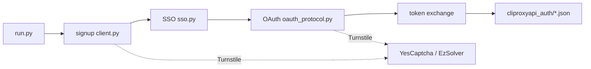

> [简体中文](README.md) | **English**

# grok-build-auth

A **protocol-research client** for publicly observable **x.ai / Grok web authentication** flows. It reimplements, over pure HTTP:

`signup → SSO → OAuth PKCE (Grok Build / CLI scopes) → local auth JSON export`

for protocol analysis, interoperability research, and **authorized** local integration testing.

The default path does not launch a browser. Cloudflare Turnstile supports two backends:

- **YesCaptcha** (or any createTask-compatible service)
- **[EzSolver](https://github.com/ismoiloffS/EzSolver)** (local real-Chrome solver service)

[](LICENSE)
[](https://www.python.org/)
[](#legal-boundary)

---

> [!CAUTION]
> **Using this project constitutes acceptance of all terms in [`NOTICE`](NOTICE).**  
> Provided **AS IS**, with **no warranties**. Maintainers accept **no liability**.  
> **Allowed only** on systems you own / legitimate CTF / authorized bug-bounty in-scope assets / security research & education.  
> **Prohibited:** fraud, bulk account farming for resale, unauthorized targets, intentional ToS abuse.  
> You bear all legal responsibility. If you do not accept the terms, **do not use, do not clone, delete every copy**.

---

## Legal boundary

| | |
|---|---|
| **Allowed** | Your own accounts and environments; clearly authorized security research; CTF / academic protocol study; offline source reading |
| **Prohibited** | Fraud, bulk signup for resale, unlicensed automation against unauthorized targets, intentional platform abuse |
| **Liability** | Account bans, quota loss, civil / criminal / administrative outcomes — **all on the user** |
| **Affiliation** | **Not** affiliated with, endorsed by, or sponsored by xAI, Grok, Cloudflare, CLIProxyAPI, captcha vendors, or mailbox vendors |

Full terms: [`NOTICE`](NOTICE). License is [MIT](LICENSE), but **MIT is not the entire disclaimer**.

If you are unsure whether your use is lawful — **do not run**. Ask a lawyer first, or contact the target platform’s security team.

---

## What this is

A research-oriented protocol client, **not** an official SDK.

| Stage | Content |
|---|---|
| **Signup** | Email code (gRPC-web) + Turnstile + Next.js Server Action on `accounts.x.ai` |
| **SSO** | Session JWT extraction for OAuth session reuse |
| **OAuth** | `auth.x.ai` PKCE + cookie-setter + consent; CreateSession fallback |
| **Export** | Local `type=xai` auth files compatible with [CLIProxyAPI](https://github.com/router-for-me/CLIProxyAPI) (Grok Build channel) |

Highlights:

- **Protocol-first** pure HTTP (`curl_cffi`) by default
- **Dual Turnstile backends**: YesCaptcha / EzSolver via `TURNSTILE_SOLVER`
- **SSO reuse** can skip a second Turnstile on OAuth
- **Interop export** for `cli-chat-proxy.grok.com` + grok-cli headers — **not** the paid `api.x.ai` credits API path
- Concurrent signup workers; OAuth serialized by default

SSO **alone cannot** become a CPA auth file; OAuth tokens are required.

---

## Architecture



---

## Requirements

- Python 3.9+
- A Turnstile backend:
  - YesCaptcha (or createTask-compatible) API key, **or**
  - Local [EzSolver](https://github.com/ismoiloffS/EzSolver) service (`TURNSTILE_SOLVER=ezsolver`)
- Tempmail.lol API key **or** your own Cloudflare D1 alias mailbox
- Optional HTTP(S) proxy
- Optional local CLIProxyAPI install to load exported auth files

Platform terms, risk controls, and API changes may break the flow at any time. Maintainers have **no obligation** to keep it working.

---

## Getting started

### Install

```bash
git clone https://github.com/50521136/grok-build-auth.git
cd grok-build-auth
python -m venv .venv

# Windows
.venv\Scripts\activate
# macOS / Linux
# source .venv/bin/activate

pip install -r requirements.txt
cp .env.example .env
# edit .env with your own secrets — never commit .env
```

### Configuration

| Variable | Required | Description |
|---|---|---|
| `TURNSTILE_SOLVER` | no | `yescaptcha` / `ezsolver`; auto-detect if omitted |
| `YESCAPTCHA_API_KEY` | conditional | required for `yescaptcha` |
| `YESCAPTCHA_ENDPOINT` | no | default `https://api.yescaptcha.com` |
| `EZSOLVER_ENDPOINT` | conditional | for `ezsolver`, default `http://127.0.0.1:8191` |
| `EZSOLVER_TIMEOUT` | no | EzSolver timeout seconds, default `120` |
| `TEMPMAIL_API_KEY` | when `-e tempmail` | temporary mailbox |
| `CLOUDFLARE_API_TOKEN` | when `-e cloudflare` | CF API token |
| `CLOUDFLARE_ACCOUNT_ID` | same | CF account |
| `CLOUDFLARE_D1_DB_ID` | same | D1 database ID |
| `ALIAS_MAIL_DOMAINS` | same | mailbox domains you control (comma-separated) |
| `CLIPROXYAPI_AUTH_DIR` | no | default `./cliproxyapi_auth` |
| `HTTPS_PROXY` / `HTTP_PROXY` | no | proxy |

Auto-detect order:

1. `TURNSTILE_SOLVER` if set
2. else `YESCAPTCHA_API_KEY` present → `yescaptcha`
3. else `EZSOLVER_ENDPOINT` present → `ezsolver`
4. default `yescaptcha`

### Turnstile backends

#### Option A: YesCaptcha (default)

```env
TURNSTILE_SOLVER=yescaptcha
YESCAPTCHA_API_KEY=your_key
# YESCAPTCHA_ENDPOINT=https://cn.yescaptcha.com
```

#### Option B: EzSolver (local real browser)

1. Start [EzSolver](https://github.com/ismoiloffS/EzSolver) in another terminal (Chrome required):

```bash
git clone https://github.com/ismoiloffS/EzSolver.git
cd EzSolver
pip install nodriver
python service.py
# listens on http://0.0.0.0:8191 by default
```

2. Configure this project:

```env
TURNSTILE_SOLVER=ezsolver
EZSOLVER_ENDPOINT=http://127.0.0.1:8191
EZSOLVER_TIMEOUT=120
```

Notes:

- EzSolver runs as a **separate process**. This repo only ships an HTTP client for it.
- Signup and protocol-OAuth CreateSession share the same solver instance path.
- `premium=True` only affects YesCaptcha (M1 tier); EzSolver ignores it.

**Never** commit `.env` or token output directories. See [`SECURITY.md`](SECURITY.md).

### Run (research / own-account scenarios)

```bash
# full pipeline
python run.py -n 1

# concurrent signup (OAuth still serial)
python run.py -n 5 -t 3

# Cloudflare mailbox backend
python run.py -n 1 -e cloudflare

# signup + SSO only
python run.py -n 1 --no-oauth
```

Startup logs include `solver=yescaptcha|ezsolver` so you can verify the backend.

---

## Layout (excerpt)

```text
run.py                      # entrypoint
xconsole_client/
  solver.py                 # YesCaptcha + EzSolver
  client.py                 # signup protocol
  oauth_protocol.py         # pure-protocol OAuth
  xai_oauth.py              # OAuth export / fallbacks
  sso.py / mailbox.py / ...
alias_mail/                 # Cloudflare alias mail helpers
.env.example
```

---

## Security

See [`SECURITY.md`](SECURITY.md). Do not upload API keys, SSO JWTs, OAuth tokens, or exported auth JSON to public repos or chat logs.

---

## License

[MIT](LICENSE). Also read [`NOTICE`](NOTICE) before use.
