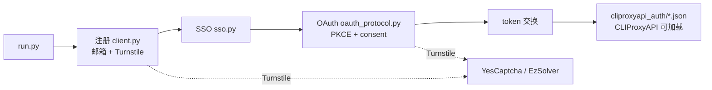

> **简体中文** | [English](README.en.md)

# grok-build-auth

面向 **x.ai / Grok 公开 Web 认证链路** 的协议研究客户端：用纯 HTTP 复现  
`注册 → SSO → OAuth PKCE（Grok Build / CLI scope）→ 导出本地 auth JSON`  
整条链路，便于协议分析、互操作性研究与本地集成测试。

默认路径不依赖浏览器。Turnstile 支持两种打码后端：

- **YesCaptcha**（或 createTask 兼容服务）
- **[EzSolver](https://github.com/ismoiloffS/EzSolver)**（本地真实 Chrome 打码服务）

[](LICENSE)
[](https://www.python.org/)
[](#法律边界)

---

> [!CAUTION]
> **使用本项目即视为同意 [`NOTICE`](NOTICE) 的全部条款。**  
> 项目按 **AS IS** 提供、无任何担保、维护者不负任何责任。  
> **仅限**：你拥有的系统 / 合法 CTF / 授权 bug bounty in-scope 资产 / 安全研究与教学。  
> **严禁**：欺诈、批量造号转售、黑产代注册、未授权目标、故意违反第三方 ToS。  
> 一切法律责任由使用者自负。不接受条款就**不要使用、不要 clone、删除全部副本**。

---

## 法律边界

| | 说明 |
|---|---|
| **允许** | 自有账号与本地环境；明确授权范围内的安全研究；CTF / 课堂 / 学术协议研究；离线阅读源码 |
| **禁止** | 欺诈滥用、批量造号转售、代注册牟利、未授权自动化攻击、规避平台安全机制用于非法目的 |
| **责任** | 账号封禁、额度损失、民事 / 刑事 / 行政责任等全部由**使用者**承担 |
| **关系** | 与 xAI、Grok、Cloudflare、CLIProxyAPI、任何打码 / 邮箱服务商**无隶属、无授权、无赞助** |

完整条款见 [`NOTICE`](NOTICE)。License 是 [MIT](LICENSE)，但 **MIT 不是免责的全部**。

不确定是否合法 —— **不要运行**。先问律师，或先联系目标平台安全团队。

---

## 这是什么

研究型协议客户端，不是官方 SDK。主要能力：

| 阶段 | 内容 |
|---|---|
| **注册** | `accounts.x.ai` 邮箱验证码（gRPC-web）+ Turnstile + Next.js Server Action 建号 |
| **SSO** | 从建号响应 / set-cookie 链提取 session JWT，供 OAuth 复用 |
| **OAuth** | `auth.x.ai` PKCE + CookieSetter + consent；失败时再走 CreateSession |
| **导出** | 写出与 [CLIProxyAPI](https://github.com/router-for-me/CLIProxyAPI) 兼容的本地 `type=xai` auth 文件（Grok Build 通道） |

值得看的点：

- **协议优先**：默认纯 HTTP（`curl_cffi` 指纹会话），不启浏览器
- **双打码后端**：YesCaptcha / EzSolver 可通过 `TURNSTILE_SOLVER` 切换
- **SSO 复用**：注册 session 可跳过 OAuth 二次打码（快路径）
- **互操作导出**：`cli-chat-proxy.grok.com` + grok-cli headers，**不是** `api.x.ai` 计费 API 密钥通道
- **并发注册**：注册可多线程；OAuth 默认串行，降低会话冲突

---

## 架构



SSO **不能**单独变成 CPA auth 文件；必须完成 OAuth 拿到 `access_token` / `refresh_token` 后才能导出。

---

## 现状与门槛

这不是「零配置即用」的产品。至少需要：

- Python 3.9+
- Turnstile 打码后端其一：
  - YesCaptcha（或兼容 createTask 协议）API key
  - 本地 [EzSolver](https://github.com/ismoiloffS/EzSolver) 服务（`TURNSTILE_SOLVER=ezsolver`）
- 临时邮箱：Tempmail.lol API key，**或**你自建的 Cloudflare D1 别名邮箱
- （可选）HTTP(S) 代理
- （可选）本地已安装的 CLIProxyAPI，用于加载导出的 auth 目录

平台条款、风控、接口变更会导致链路随时失效；维护者**无义务**持续适配。

---

## 上手

### 安装

```bash
git clone https://github.com/50521136/grok-build-auth.git
cd grok-build-auth
python -m venv .venv

# Windows
.venv\Scripts\activate
# macOS / Linux
# source .venv/bin/activate

pip install -r requirements.txt
cp .env.example .env
# 编辑 .env：只填你自己的密钥，切勿提交 .env
```

### 配置

| 变量 | 必须 | 说明 |
|---|---|---|
| `TURNSTILE_SOLVER` | 否 | `yescaptcha` / `ezsolver`；不填则自动检测 |
| `YESCAPTCHA_API_KEY` | 条件 | `yescaptcha` 时必填 |
| `YESCAPTCHA_ENDPOINT` | 否 | 默认 `https://api.yescaptcha.com`；国内可用 `https://cn.yescaptcha.com` |
| `EZSOLVER_ENDPOINT` | 条件 | `ezsolver` 时使用，默认 `http://127.0.0.1:8191` |
| `EZSOLVER_TIMEOUT` | 否 | EzSolver 超时秒数，默认 `120` |
| `TEMPMAIL_API_KEY` | `-e tempmail` 时 | 临时邮箱 |
| `CLOUDFLARE_API_TOKEN` | `-e cloudflare` 时 | CF API token |
| `CLOUDFLARE_ACCOUNT_ID` | 同上 | CF 账户 |
| `CLOUDFLARE_D1_DB_ID` | 同上 | D1 库 ID |
| `ALIAS_MAIL_DOMAINS` | 同上 | 你控制的邮箱域名（逗号分隔） |
| `CLIPROXYAPI_AUTH_DIR` | 否 | 默认 `./cliproxyapi_auth` |
| `HTTPS_PROXY` / `HTTP_PROXY` | 否 | 代理 |

自动检测规则：

1. 有 `TURNSTILE_SOLVER` → 按该值
2. 否则有 `YESCAPTCHA_API_KEY` → `yescaptcha`
3. 否则有 `EZSOLVER_ENDPOINT` → `ezsolver`
4. 默认 `yescaptcha`

### Turnstile 打码后端

#### 方案 A：YesCaptcha（默认）

```env
TURNSTILE_SOLVER=yescaptcha
YESCAPTCHA_API_KEY=your_key
# YESCAPTCHA_ENDPOINT=https://cn.yescaptcha.com
```

#### 方案 B：EzSolver（本地真实浏览器）

1. 另开终端启动 [EzSolver](https://github.com/ismoiloffS/EzSolver)（需已安装 Chrome）：

```bash
git clone https://github.com/ismoiloffS/EzSolver.git
cd EzSolver
pip install nodriver
python service.py
# default: http://0.0.0.0:8191
```

2. 本项目 `.env`：

```env
TURNSTILE_SOLVER=ezsolver
EZSOLVER_ENDPOINT=http://127.0.0.1:8191
EZSOLVER_TIMEOUT=120
```

说明：

- EzSolver 是**独立进程**；本仓库只做 HTTP 客户端，不内置其浏览器逻辑
- 注册与协议 OAuth 的 CreateSession 都复用同一 solver
- `premium=True` 仅对 YesCaptcha 生效（M1）；EzSolver 忽略该参数

**永远不要**把 `.env`、token 目录提交进 Git。详见 [`SECURITY.md`](SECURITY.md)。

### 运行（研究 / 自有账号场景）

```bash
# full pipeline: signup + SSO + OAuth + export
python run.py -n 1

# concurrent signup (OAuth still serial)
python run.py -n 5 -t 3

# Cloudflare mailbox backend
python run.py -n 1 -e cloudflare

# signup + SSO only
python run.py -n 1 --no-oauth
```

启动时会打印当前 `solver=yescaptcha|ezsolver`，便于确认后端。

---

## 目录结构（摘要）

```text
run.py                      # entrypoint
xconsole_client/
  solver.py                 # YesCaptcha + EzSolver
  client.py                 # signup protocol
  oauth_protocol.py         # pure-protocol OAuth
  xai_oauth.py              # OAuth export / fallbacks
  sso.py / mailbox.py / ...
alias_mail/                 # Cloudflare alias mail helpers
.env.example
```

---

## 安全

见 [`SECURITY.md`](SECURITY.md)。勿将 API key、SSO JWT、OAuth token、导出 auth JSON 上传到任何公开仓库或聊天记录。

---

## License

[MIT](LICENSE)。使用前请同时阅读 [`NOTICE`](NOTICE)。
